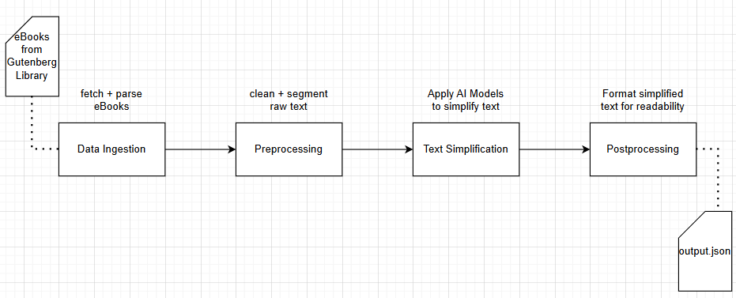

# Text Simplification Application

A tool designed to make reading complex texts more accessible by simplifying sentence structure and vocabulary. The application processes eBooks from the Gutenberg library, applies AI-based text simplification, and outputs the simplified text in a user-friendly format.

This project was a part of the module `Software-Project` for the Winter Semester 2024/25 at `Hochschule für Technik Stuttgart`.

## 📖 Overview

The <b>Text Simplification Application</b> streamlines complex texts into simpler, more readable versions. It is ideal for enhancing accessibility and comprehension. The application performs the following:

1. Fetches eBooks from the Gutenberg library.
2. Cleans and segments the raw text.
3. Simplifies the text using AI models.
4. Formats the output for easy readability.

## 🔑 Key Modules and Pipeline



## 🛠 Installation

### 1. Prerequisites

* Python 3.8 or higher
* Docker
*  MySQL 8.0.40 Community Edition (.msi for Windows (306.4M))

### 2. Initial Setup

1. Clone the repository

```bash
git clone https://github.com/Sanjay9921/Winter 2024/WS24-Software-Project/Text-Simplification.git
```

2. Setup a virtual environment for python

```bash
python -m venv venv
source venv\Scripts\activate # Mac: source venv/bin/activate
```

3. Install Dependencies

```bash
pip install -r requirements.txt
```

### 3. Database Setup

#### 3.1 Local Database Setup

> [!TIP]
> For local development: Use `main.py`.

* Create .env file in the same directory as the ``main.py``

   ```bash
   # .env file for local db setup
   # Database configuration
   DB_USERNAME=root
   DB_PASSWORD=root
   DB_HOST=localhost
   DB_NAME=gutenberg_db
   ```

* Creating the local MySQL database

   ```sql
   create database gutenberg_db;
   show databases;
   ```

#### 3.2 Docker Setup

> [!TIP]
> For deployment or testing in a consistent environment: Use Docker.

* Create .env file in Docker

   ```bash
   # .env file for running in docker
   DB_USERNAME=root
   DB_PASSWORD=root
   DB_HOST='host.docker.internal' # 'docker.for.mac.host internal' for mac
   DB_NAME=test
   ```


## 🚀 Usage

### 1. Run the application locally

> [!NOTE]  
> Running `main.py` requires you to have all dependencies installed locally and the database configured manually.

```bash
python main.py
```

* Access the application at: http://127.0.0.1:5000

### 2. Run the application on Docker

> [!NOTE]  
> Running via Docker encapsulates everything into a container, making it easier to set up without worrying about local dependencies.

* Ensure Docker is installed and open it to start the Docker Daemon.

* Build Docker image:

   ```bash
   # Ex of<IMAGE_NAME>: gpt-neo-flask-api
    docker build -t <IMAGE_NAME> . 
   ```

* Run docker container:
   
   ```bash
   # Ex of<IMAGE_NAME>: gpt-neo-flask-api
   docker run --add-host host.docker.internal:host-gateway -p 5000:5000 <IMAGE_NAME>
   ```

* Access the application at: http://127.0.0.1:5000

## 🤝 Contributing
I welcome contributions! Here's how you can help:

1. Fork the repository and clone it locally.

2. Create a new branch for your feature:
```bash
git checkout -b your-feature-name
```

3. Make your changes and commit them:
```bash
git commit -m "Add feature"
```

4. Push your branch to GitHub:
```bash
git push origin your-feature-name
```

5. Open a Pull Request describing your changes.

## Helpful Links

* <a href="https://gist.github.com/cseeman/8f3bfaec084c5c4259626ddd9e516c61">README.md markdown options</a>
